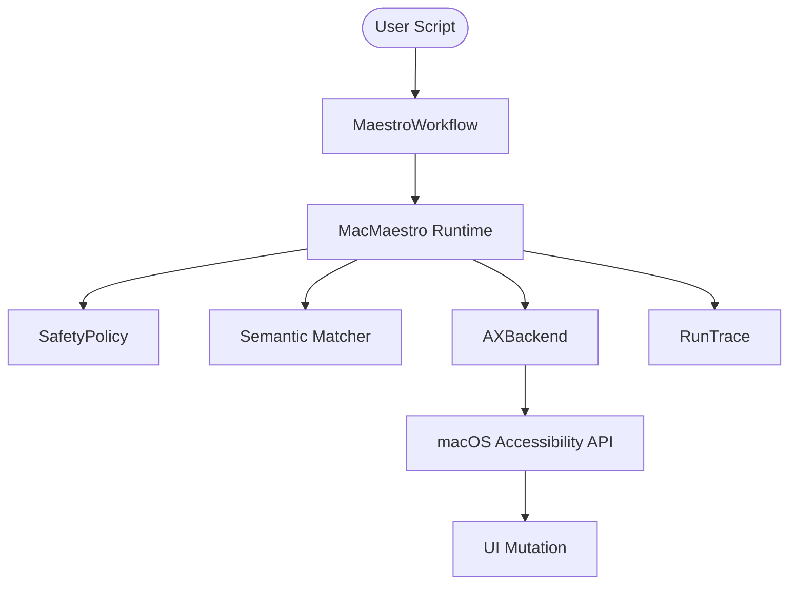

# MacMaestro (MAC-MAESTRO-Ω v0.1.0)

**Semantic-first macOS GUI automation with safety gates and structured traces.**

Stop relying on brittle coordinate clicks (`x: 100, y: 200`) and pixel-matching. MacMaestro uses the native macOS Accessibility (AX) API to understand the semantic structure of any application, delivering robust and deterministic automation workflows for autonomous AI agents.

## Why not another PyAutoGUI wrapper?

Most desktop automation libraries fail when windows move, resolutions change, or UI focus shifts. MacMaestro solves this by reading the actual UI graph:

- **Semantic-First Matching**: Target elements by intent (`role="AXButton"`, `title="Submit"`).
- **AX Native Execution**: Bypasses the mouse cursor entirely for typing and clicking when possible.
- **Safety Membrane**: Immutable policies that prevent your AI agent from clicking dangerous elements (e.g., "Delete", "Format").
- **Observable by Default**: Every action generates a detailed, nested JSON `RunTrace` showing exactly what the system saw and what it clicked.

---

> ⚠️ **Accessibility Permissions**: MacMaestro requires the terminal or host app running it to be granted **Accessibility** permissions in macOS (`System Settings > Privacy & Security > Accessibility`).

## Installation

```bash
pip install "mac-maestro[macos,mcp]"
```

## Quick Start: 20-Second Demo

Here is how you control an application like TextEdit without ever hardcoding a screen coordinate.

```python
from mac_maestro import MacMaestro, ClickAction, TypeAction

# Connect directly to the application's semantic graph
maestro = MacMaestro(bundle_id="com.apple.TextEdit")

# Declare intent
actions = [
    ClickAction(role="AXButton", title="New Document"),
    TypeAction(text="Automation without x/y coordinates. 🚀")
]

# Execute deterministically
trace = maestro.run(actions)

print("Success!" if trace.ok else f"Failed: {trace.error}")
print(trace.to_json()) # Structured data for your autonomous agent
```

*See `examples/demo_textedit.py` for a fully runnable version.*

## Advanced Usage: Workflows

Use `MaestroWorkflow` for robust automation that handles UI delays.

```python
from mac_maestro import MacMaestro, MaestroWorkflow, ElementSelector

maestro = MacMaestro(bundle_id="com.apple.Music")
workflow = MaestroWorkflow(maestro)

# Wait for an element to appear (up to 10s)
workflow.wait_for(ElementSelector(role="AXButton", title="Play"))

# Run with retries
workflow.run_with_retry(actions, max_retries=3)
```

## MCP Server (Model Context Protocol)

`mac-maestro` can be run as an MCP server, allowing AI agents (like Claude Desktop, Cursor, or Gemini) to interact with your macOS UI directly.

### Installation & Setup

1. **Install with MCP support**:
   ```bash
   pip install "mac-maestro[mcp]"
   ```

2. **Configure your client**:
   Add the following to your MCP settings file (e.g., `cursor_settings.json` or `claude_desktop_config.json`):

   ```json
   {
     "mcpServers": {
       "mac-maestro": {
         "command": "python3",
         "args": ["-m", "mac_maestro.mcp_server"]
       }
     }
   }
   ```

### Exposed Tools

- `get_ui_snapshot`: Captures the Accessibility tree of a specific app or the whole system.
- `click_element`: Clicks UI components using semantic selectors (role, title, text).
- `type_in_app`: Focuses an app and types text.
- `press_key`: Sends raw key-press events (e.g., "enter", "escape").

## Architecture




## License

Apache-2.0
