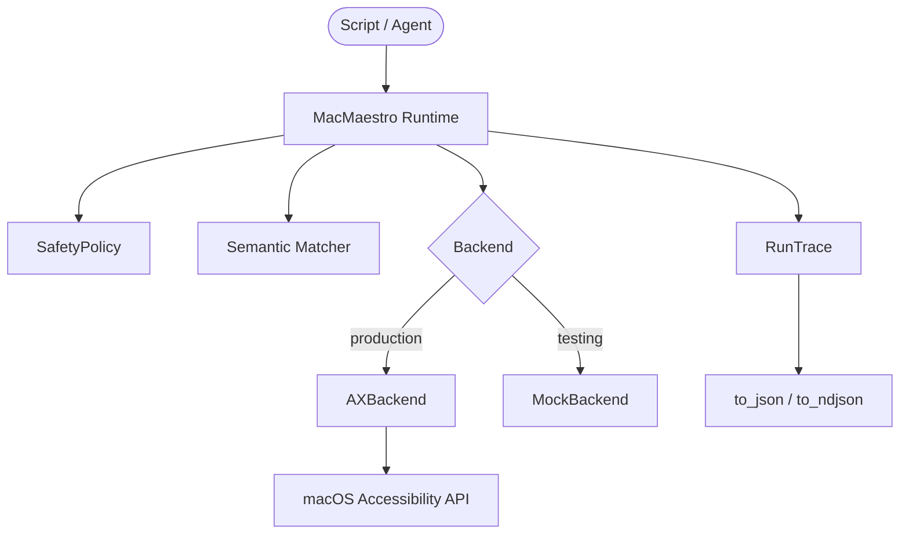

# mac-maestro

Semantic-first macOS GUI automation with safety gates and structured traces.

> Stop relying on brittle coordinate clicks. `mac-maestro` reads the native macOS Accessibility graph to match UI elements by **intent** — not pixels.

## Why

| | PyAutoGUI / pixel bots | mac-maestro |
|:---|:---|:---|
| Targeting | `x: 100, y: 200` | `role="AXButton", title="Save"` |
| Window moves | Breaks | Works |
| Resolution changes | Breaks | Works |
| Safety | None | Immutable policy membrane |
| Observability | Logs | Structured `RunTrace` (JSON/NDJSON) |

## Features

- **Semantic matching** by role, title, value — walks the AX tree, scores candidates
- **Safety policy** blocks destructive actions (`"Delete"`, `"Format"`) before execution
- **Dry-run mode** resolves and matches without mutating the UI
- **Confidence thresholds** with configurable policies: `abort`, `fallback_exact`, `emit_candidates`
- **Structured traces** — every action emits JSON events; `to_ndjson()` for streaming
- **Backend abstraction** — `MockBackend` for tests, `AXBackend` for real macOS automation
- **Native AX execution** — `AXPress` and `AXSetValue` bypass the mouse cursor entirely

## Install

```bash
pip install mac-maestro              # Core (works anywhere)
pip install "mac-maestro[macos]"     # + native AX backend (macOS only)
```

> ⚠️ **Accessibility Permissions**: The terminal or host app must be granted **Accessibility** access in `System Settings > Privacy & Security > Accessibility`.

## Quick Start

Works on any platform with `MockBackend` — no macOS permissions needed:

```python
from mac_maestro import MacMaestro, ClickAction
from mac_maestro.backends.mock import MockBackend
from mac_maestro.models import AXNodeSnapshot

# Build a mock UI tree
root = AXNodeSnapshot(
    element_id="root",
    role="AXWindow",
    title="Main",
    children=[
        AXNodeSnapshot(element_id="save_btn", role="AXButton", title="Save"),
        AXNodeSnapshot(element_id="cancel_btn", role="AXButton", title="Cancel"),
    ],
)

maestro = MacMaestro(
    bundle_id="com.example.app",
    backend=MockBackend(root=root),
)

trace = maestro.run([ClickAction(role="AXButton", title="Save")])

print("✅" if trace.ok else "❌")
print(trace.to_json())
```

## Advanced

### Dry-Run Mode

Resolve elements and score candidates without touching the UI:

```python
trace = maestro.run(actions, dry_run=True)
# trace.ok is True, but no UI mutation occurred
```

### Confidence Thresholds

Reject low-confidence matches before they execute:

```python
maestro = MacMaestro(
    bundle_id="com.apple.TextEdit",
    backend=backend,
    min_confidence=0.75,
    on_below_threshold="abort",  # or "fallback_exact", "emit_candidates"
)
```

### Safety Policy

Block dangerous interactions at the membrane level:

```python
from mac_maestro.safety import SafetyPolicy

policy = SafetyPolicy(blocked_titles=["Delete All", "Format Disk"])
maestro = MacMaestro(bundle_id="...", backend=backend, safety_policy=policy)
# ClickAction(title="Delete All") → SafetyViolationError
```

### NDJSON Traces

Stream trace events for log ingestion:

```python
print(trace.to_ndjson())
# One JSON line per event — ready for jq, Datadog, or CORTEX
```

## Architecture



## License

Apache-2.0
