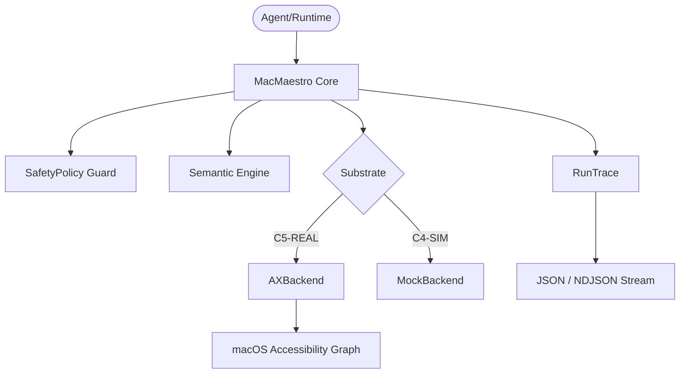

# MAC-MAESTRO 

**Reality Level: C5-REAL** | **Aesthetic: Industrial Noir 2026**

Semantic-first macOS GUI automation with safety gates, zero black-box magic, and structured traces.

> Stop relying on brittle coordinate clicks. `mac-maestro` reads the native macOS Accessibility graph to match UI elements by **intent** — not pixels.

## 01 · Execution Mechanics

| Vector | PyAutoGUI / Pixel Bots | MAC-MAESTRO |
| :--- | :--- | :--- |
| **Targeting** | `x: 100, y: 200` | `role="AXButton", title="Save"` |
| **Window moves** | Breaks | Works |
| **Resolution changes**| Breaks | Works |
| **Safety** | None | Immutable C5-REAL policy membrane |
| **Observability** | Standard logs | Structured `RunTrace` (JSON/NDJSON) |

## 02 · Capability Matrix

- **Semantic Matching**: Role, title, value targeting. Walks the AX tree, scores candidates deterministically.
- **Epistemological Kill Switch (Safety Policy)**: Blocks destructive actions (`"Delete"`, `"Format"`) before execution.
- **Dry-Run Mode**: Resolves and matches without UI mutation.
- **Confidence Thresholds**: Configurable routing (`abort`, `fallback_exact`, `emit_candidates`).
- **Structured Traces**: Every action emits JSON events. `to_ndjson()` for high-throughput streaming.
- **Native AX Execution**: `AXPress` and `AXSetValue` bypass cursor entirely.

## 03 · Initialization

```bash
# Core framework
pip install mac-maestro              

# + Native AX backend (macOS C5-REAL)
pip install "mac-maestro[macos]"     
```

> **[P0] Accessibility Sentinel**: The host environment MUST hold **Accessibility** clearance (`System Settings > Privacy & Security > Accessibility`).

## 04 · Usage Vectors

### Base Simulator (C4-SIM)
Cross-platform MockBackend validation.

```python
from mac_maestro import MacMaestro, ClickAction
from mac_maestro.backends.mock import MockBackend
from mac_maestro.models import AXNodeSnapshot

# Build mock UI tree
root = AXNodeSnapshot(
    element_id="root", role="AXWindow", title="Main",
    children=[
        AXNodeSnapshot(element_id="save_btn", role="AXButton", title="Save"),
        AXNodeSnapshot(element_id="cancel_btn", role="AXButton", title="Cancel"),
    ],
)

maestro = MacMaestro(bundle_id="com.example.app", backend=MockBackend(root=root))
trace = maestro.run([ClickAction(role="AXButton", title="Save")])

print("C5-REAL" if trace.ok else "C4-FAIL")
print(trace.to_json())
```

### Dry-Run Topology (C4-SIM)
```python
trace = maestro.run(actions, dry_run=True)
# State: trace.ok=True, UI mutation=0
```

### Confidence Gates
```python
maestro = MacMaestro(
    bundle_id="com.apple.TextEdit",
    backend=backend,
    min_confidence=0.75,
    on_below_threshold="abort",  # or "fallback_exact", "emit_candidates"
)
```

### Epistemic Membrane (Safety)
```python
from mac_maestro.safety import SafetyPolicy

policy = SafetyPolicy(blocked_titles=["Delete All", "Format Disk"])
maestro = MacMaestro(bundle_id="...", backend=backend, safety_policy=policy)
# ClickAction(title="Delete All") → SafetyViolationError
```

### Trace Ingestion
```python
print(trace.to_ndjson())
# Output ready for jq, Datadog, or CORTEX Persist ingestion
```

## 05 · Architecture Topology



## 06 · License
Apache-2.0
